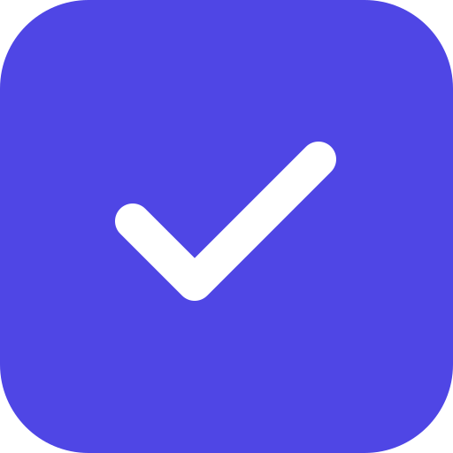

<div align="center">
  

  <h1>Defect Diary</h1>

  <p>
    <strong>A modern, cross-platform defect tracking and management application.</strong>
  </p>

  <p>
    <a href="#features">Features</a> •
    <a href="#tech-stack">Tech Stack</a> •
    <a href="#getting-started">Getting Started</a> •
    <a href="#legal">Legal</a>
  </p>
  
  <p>
    
    
    
    
  </p>
</div>

---

## 📖 Overview

Defect Diary is a comprehensive, cross-platform application designed to streamline defect and issue management. Whether you're on the Web, Windows Desktop, iOS, or Android, you can track bugs in real-time, capture evidence, and collaborate efficiently.

## ✨ Features

- 📱 **Cross-Platform Delivery:** Build once, deploy everywhere. Support for Web, Windows (via Electron), and Mobile (iOS & Android via Capacitor).
- ⚡ **Real-Time Sync:** Instant updates across all clients powered by a Node.js Express backend and **Socket.IO**.
- 🎨 **Modern Aesthetics:** A beautiful, responsive user interface built with **React** and styled using **Tailwind CSS**.
- 🤖 **AI-Powered Insights:** Integrated with **Google GenAI** to help analyze defect patterns and suggest fixes.
- 🔐 **Secure Authentication:** Enterprise-grade security leveraging **Azure MSAL Browser**.
- 📸 **Media Capture:** Direct integration with device cameras to snap photos of defects on the go.

## 🛠️ Tech Stack

### Frontend & UI
- **Framework:** React 19, Vite
- **Styling:** Tailwind CSS (v4)
- **Icons:** Lucide React
- **Charts:** Recharts

### Backend & Real-time
- **Server:** Node.js, Express
- **Real-time:** Socket.IO

### Native Shells
- **Desktop:** Electron
- **Mobile:** Capacitor (iOS, Android)

## 🚀 Getting Started

### Prerequisites
- [Node.js](https://nodejs.org/) (v18 or higher)
- [npm](https://www.npmjs.com/)

### Installation

1. **Clone the repository:**
   ```bash
   git clone <your-repo-url>
   cd Defect-Detectives
   ```

2. **Install dependencies:**
   ```bash
   npm install
   ```

### Running the Application

**Web Development Server & Backend API:**
```bash
npm run dev
```

**Desktop (Electron) Development:**
```bash
npm run electron:dev
```

**Mobile (Capacitor) Development:**
```bash
npm run cap:ios     # For iOS
npm run cap:android # For Android
```

### Building for Production

- **Web:** `npm run build`
- **Electron:** `npm run electron:build`
- **Mobile Sync:** `npm run cap:sync`

## 📜 Legal

By using this application, you agree to the following terms and policies:
- [Terms and Conditions](./TERMS_AND_CONDITIONS.md)
- [Privacy Policy](./PRIVACY_POLICY.md)

---
<div align="center">
  Made with ❤️ by the Defect Diary Team
</div>
